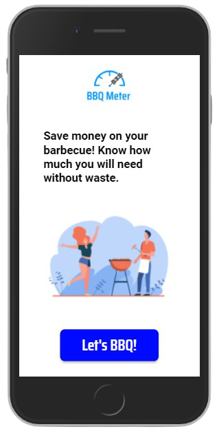

# Barbecue Meter

Webpage that calculates the amount of meat and drink for a barbecue, having as parameters the number of people and duration of the event.

## Screenshots

## Stack used

**Front-end:** HTML, CSS (SASS), JS

## License

[MIT](https://choosealicense.com/licenses/mit/)

if you liked this repo! fork and give a star!

